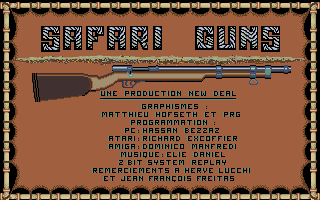

# Safari Guns with game intro & multi-languages support

**Cracked, mega-trained, partly-filed, packed, linked, ramdisk,
bug-fixed, 512KB, hard-drive and Falcon/TT/CT60 support.**

In this folder,
- ***[release](release)*** contains the floppy image of the crack.
- ***[src](src)*** provides the source files of the crack,
with plenty of explanations and comments.

Here are the technical details about
*[Safari Guns](http://www.atarimania.com/game-atari-st-safari-guns_24849.html)*,
including the copy-protection, the description of various bugs in the
game that needed to be fixed, and the work needed to support the Falcon
machine.

Please look at ***[src/LOADER.S](src/LOADER.S)*** for the implementation of all
the stuffs described hereafter.

*Safari Guns* comes on two floppy disks:
- The first disk has two independent sides. Both sides have 80 tracks
  (0-79), but the first side has 10 sectors per track, while the second
  side has only 9 sectors per track.  
  The first side of the first disk contains 32 data files and
  2 executable programs (in the auto folder):
  - the intro, a GFA compiled program.
  - the game, a C compiled program.  
  
  The second side of the first disk contains the intro music sample
  stored on sectors directly without a filesystem.  
- The second disk has only one side containing 80 tracks with 10 sectors
  per track.  
  This disk contains 100 data files.

The game protection is the following:
- The intro program checks the occupancy of the first disk (the free disk
  space) and refuses to run if it is different from the expected value.
- The two sides of the first disk are formatted differently (10 sectors
  per track on the first side, versus 9 sectors per track on the second
  side).
- On the first disk, the last track (79) of first side is copy-protected.
  This track is checked by the game after the display of the credits
  (at the very beginning of the game loading).  
  If this check fails (disk is a copy), the game is altered so that the
  gun cannot be used (game is not playable).  
  If the corresponding copy-protection routine is not executed (as the
  result of a naive crack), then the mouse cannot be used (user gets
  stuck during flags selection).
- On the second disk, track 50 of first side is copy-protected.
  This track is checked randomly when loading the game by a second
  copy-protection routine.  
  If this check fails, the game is altered so that it will later crash.
- A third copy-protection routine exists in the code but it is never
  called.
- The game does a checksum on the first copy-protection routine, ie it
  checks if that routine has been modified (typically by a hacker).  
  If the checksum routine detects a modification, then the game freezes.
  This check is performed after playing the game.

In addition to the different protection techniques implemented in the
game, there were two other difficulties to make an advanced crack
(packed and HD-compatible version):
- the music sample of the intro is directly stored on sectors without a
  filesystem. Therefore the music sample needs to be extracted and saved
  as normal files, and the intro code needs to be modified accordingly
  so that it loads the music sample from those files.
- the intro needs about $70000 Bytes (448KB, including the video memory)
  to run, thus leaving very few memory on a 512KB machine for the
  unpacking/single-file loader (minimal TOS memory usage, when a program
  is launched from the auto folder, is between 40KB and 50KB depending
  on the TOS version).

There were also several bugs in the game, that had to be fixed.
Some of them already existed on ST while some others occur only on Falcon.

ST bugs:
- the intro freezes if the user presses the space key before the music
  starts.
- the intro displays an error dialog box if it is not executed from the
  auto folder.
- the game may crash after several plays because of a random
  out-of-bounds array access.
- The music sample of the game (during level loading) is noisy when it
  starts, for a short time (2/3 seconds). 

Falcon bugs:
- The intro crashes if run in non ST-low resolution.
- The intro crashes: old GFA compiled programs do not run on Falcon
  because they require 24-bits addressing mode (while the Falcon uses
  32-bits addressing mode).
- The intro and the game crash when the sample music starts playing.
  The player uses PSG shadow registers which exist on ST but not on
  falcon (leading to a bus error on this machine).
- The game crashes when the the first level screen appears.
  The game code reads the sr register in user mode. Although this
  is allowed on 68000, this generates a privilege exception on 68030.

Note that New Deal released several versions of this game with subtle
differences (supported languages, minor graphics or sound details).
The copy-protection techniques and the bugs might slightly vary from
one version to another.

The developer left an easter egg in the code of the game intro.
It is a hidden message for crackers:

    *** SAFARI GUNS (C) NEW DEAL Productions S.A. 1989 ***
    *** Atari ST version by Ric EXCOFFIER. ***
    *** If you crack this stuff, please call us for a job ***
    *** Phone: 48 70 86 94 (PARIS,FRANCE) ***
    *** We're also looking for an AY' Freaker, for our next games... Contact us !!
    *** See ya ! ***

The developer also left a signature in the main binary of the game:

    All Code by Richard Excoffier. Juillet 1989.

---

*Orion of The Replicants - December 25, 2018*
