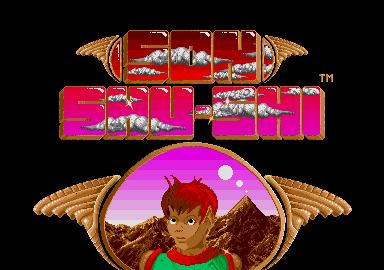

# Son Shu Shi - 100% Version

**Checksums removed, mega-trained, filed, repacked, linked, ramdisk,
bug-fixed, hard-drive and MegaSTe/Falcon/TT/CT60 support.**

In this folder,
- ***[release](release)*** contains the floppy images of the crack.
- ***[src](src)*** provides the source files of the crack,
with plenty of explanations and comments.

---

### About the Game

*[Son Shu Shi](http://www.atarimania.com/game-atari-st-son-shu-si_24613.html)*
is closely linked to the
*[Atari ST demoscene](https://www.facebook.com/groups/58270054320)*.

- It was coded by Xavier Kral (ST) and his brother Alexandre Kral (Amiga),
  both from *[The Raider Brothers](https://demozoo.org/groups/34428)*
  demo-group.
- It was published by
  *[Expose Software](http://www.atarimania.com/pgelstsoft.awp?system=S&publisher=2865)*,
  a French software-house run by members of the Atari ST demo-scene,
  mainly coming from the *[NeXT](http://www.defence-force.org/computing/demo/scene/next)*
  demo-group (who released the
  *[Phaleon Giga Demo](https://demozoo.org/productions/73226)*).
- The copy-protection of the game (described *[here](IPL.md)*) was coded
  by famous ST sceners: 
  *[Illegal](https://demozoo.org/sceners/2439)*,
  *[Zarathustra](https://demozoo.org/sceners/46865)*,
  *[Altair](https://demozoo.org/sceners/33091)*
  and *[Redhead](https://demozoo.org/sceners/2607)*.

In fact, all software published by *Expose Software* was coded by
former demo sceners:
- *[Audio Sculpture](http://www.atarimania.com/utility-atari-st-audio-sculpture_25173.html)*
  was developed by *[SYNC](https://demozoo.org/groups/2256)*.
- *[No Buddies Land](http://www.atarimania.com/game-atari-st-no-buddies-land_24603.html)*
  was developed by *[Hotline](https://demozoo.org/groups/12757)*.
- *[Euphoria](http://www.atarimania.com/game-atari-st-euphoria_28641.html)*
  was developed by *[NeXT](https://demozoo.org/groups/31770)*.

The original copy of *Son Shu Shi* is probably lost and only
*[Terminator Kid's crack](http://atariforce.free.fr/st/jeux/sonshu.zip)*
remains today.  
However, this crack has the following two flaws:
- The floppy images available on the Internet are all corrupt
  (several tracks contain only garbage), which causes crashes during
  the game. Typically, the last 2 levels of the game and the secret
  passages cannot be played due to these bad tracks.
- The *[copy-protection](IPL.md)* was not correctly removed: several
  checksum routines are still active and cause random crashes during
  the game.

---

### About this Crack

The crack provided here works 100%!  
Indeed, a developer version of the game has been found thanks to
*[Mit](https://demozoo.org/sceners/2505)* of *NeXT*.
This developer version contained all the game files in perfect
condition, which helped restore the crack of *Terminator Kid* (bad tracks
have been fixed).
The crack thus restored was used as a starting point for the enhanced
version provided here.

There were three main objectives for this release:

1. Make a 100% working crack.  
The copy-protection used in *Son Shu Shi* is outstanding and has never
been cracked properly (see *[this doc](IPL.md)* for more details).  
This new version is the first to work 100% correctly.

2. Make a file version.  
The original copy of *Son Shu Shi* is stored on two floppy disks,
both using a standard format: 2 sides, 80 tracks, 9 sectors per track.
However, the original game does not use the standard FAT12 filesystem
but loads its data from hard-coded disk areas, without TOS assistance.  
This enhanced version can run from a filesystem on a floppy disk or on
a hard-drive.

3. Support multiple machines.  
*Son Shu Shi* originally runs on Atari ST(e) only.  
This enhanced version runs on the following ST compatible machines:
*[Atari ST(e)](https://en.wikipedia.org/wiki/Atari_ST)*,
*[MegaSTe](https://en.wikipedia.org/wiki/Atari_MEGA_STE)*,
*[TT](https://en.wikipedia.org/wiki/Atari_TT030)*,
*[Falcon](https://en.wikipedia.org/wiki/Atari_Falcon)*
and *[CT60](https://gtello.pagesperso-orange.fr/falcon_e.htm)*.

All changes and improvements made to this game are implemented and
documented in ***[src/LOADER1.S](src/LOADER1.S)*** and
***[src/LOADER2.S](src/LOADER2.S)***.  
They can be sorted as follows:

**Cracking**

- Completely remove the *[copy-protection](IPL.md)* and especially
  neutralize the 4 checksum routines that are still active in *Terminator
  Kid*'s version.
- Add a *[mega-trainer](https://en.wikipedia.org/wiki/Trainer_(games))*.
- Replace the original *[Pack-Ice](https://demozoo.org/productions/81628)*
  unpacking routine with the *[UPX](https://upx.github.io)* one.
  Game files have been repacked with *UPX*.
- Use *[FDC/DMA](http://info-coach.fr/atari/documents/_mydoc/FD-HD_Programming.pdf)*
  and *[FAT12](https://en.wikipedia.org/wiki/File_Allocation_Table#FAT12)*
  routines to load game files from a filesystem, and use a
  *[ramdisk](https://en.wikipedia.org/wiki/RAM_drive)*
  when possible to speed up loading.  
  The game can now be run from:
  - Two standard floppy disks
  - A single 1.44 MB high density floppy disk (if supported by hardware)
  - A *[hard-drive](https://en.wikipedia.org/wiki/Hard_disk_drive)*
    (requires a machine with at least 2MB of RAM)

**Multi-machines support (MegaSTe/TT/Falcon/CT60)**

- Initialize the system (CPU, caches, screen) to provide an ST-compatible
  execution environment on MegaSTe, TT, Falcon and CT60 machines.
- Install improved
  *[sample replay routines](http://s390174849.online.de/ray.tscc.de/samples.htm)*
  (music modules and sound FX) that work on Falcon and do not hang on ST
  in the high score screen.
- Improve the stability of the
  *[rasters](https://en.wikipedia.org/wiki/Raster_bar)*
  in the high score screen.
- Allow the musics to be played at 50Hz, and the game
  *[frame rate](https://en.wikipedia.org/wiki/Frame_rate)*
  to run at the correct speed, on 60Hz monitors.
- Efficiently emulate the *[movep](http://68k.hax.com/MOVEP)*
  instruction on 68060 CPUs (CT60).
- Open the low border
  (*[overscan](http://alive.atari.org/alive9/ovrscn1.php)*) only on ST(e)
  machines running at 8MHz, thereby avoiding a crash on faster machines.  

**Bug-fixes**

- Install improved
  *[ACIA/IKBD](https://www.kernel.org/doc/Documentation/input/atarikbd.txt)*
  routines (keyboard/joystick) so that *IKBD* events are no longer lost.
- Modify the *game finale* (special animation played when the game
  is finished) so that it is now possible to access the high score screen
  and restart the game.
- Improve the *blank screen* routine (cleanup routine called at
  the end of every game subprogram).
- Fix a crash that may occur on fast machines when the scene (the
  background) is drawn.
- Fix an *[out-of-bounds array access](https://en.wikipedia.org/wiki/Bounds_checking)*
  when too many objects (coins, diamonds, food...) exist at the same time.
- Fix an out-of-bounds array access when too many projectiles appear
  on the screen at the same time.
- Fix an out-of-bounds array access when 6 or more weapon bonuses
  appear on the screen at the same time.
- Fix an underflow error that occurs in the state machine used to display
  enemy animations.

---

### Easter Eggs

There are no hidden messages in the code of the game, only in the code
of the copy-protection, as described *[here](IPL.md#hidden-messages)*.

The Hall of Fame (Top Five) contains the nicknames of the following
people:
- ***Ryo*** is Ryo Inagaki, the musician
- ***Xav*** is Xavier Kral, the coder of the ST version
- ***Zae*** is Saïd Hadjiat, the leader of *NeXT* and the founder of *Expose Software*
- ***Alex*** is Alexandre Kral, the coder of the Amiga version
- ***Phil*** is Philippe Deneyer, the sound FX designer

---

### Bonus

The history of *Son Shu Shi*, how it was lost and found is told in
a great *[video](https://www.youtube.com/watch?v=DGUaeOTp-bo)*
from *[Atari Legend](https://www.atarilegend.com)*.

A *[review](https://www.atarilegend.com/reviews/160)* of the game
has been written by *[ST Graveyard](https://www.facebook.com/maarten.martens.92)*

Don't miss the *[interview](https://www.atarilegend.com/interviews/48)*
with the Kral brothers about the creation of *Son Shu Shi*.

As well as the *[interview](https://www.atarilegend.com/interviews/67)*
with Saïd (*[Zae](https://demozoo.org/sceners/2507)*),
the founder of *Expose Software*.

---

*Orion of The Replicants - December 2022*
